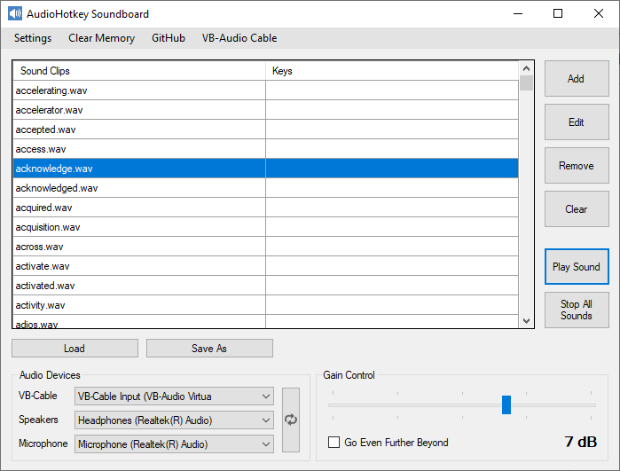

# AudioHotkey Soundboard
Forked from [JNSoundboard](https://gitlab.com/Jitnaught/JNSoundboard).

Features:
* Can play MP3, WAV, WMA, M4A, and AC3 audio files
* Play sounds through any sound device (speakers, virtual audio cable, etc.)
* "Microphone Injection" (talk while playing audio through device)
* Add, edit, remove, and clear hotkeys
* Can play a random sound out of multiple (just select multiple files when adding a hotkey)
* Save (and load) hotkeys to XML file
* Hotkey that stops currently playing sound
* Hotkey that plays currently selected sound
* Hotkeys that load XML files containing hotkeys

Setup: 
* Install a virtual audio cable (I recommend [VB-CABLE](http://vb-audio.pagesperso-orange.fr/Cable/index.htm))
* Select your audio devices in the soundboard application
* In the application you're playing sound into, set the microphone device to "VB-Audio Virtual Cable"